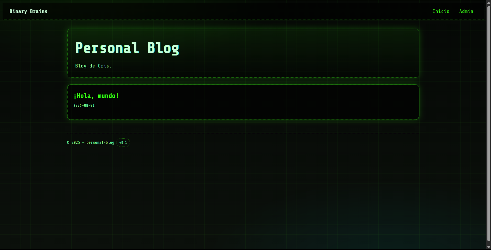
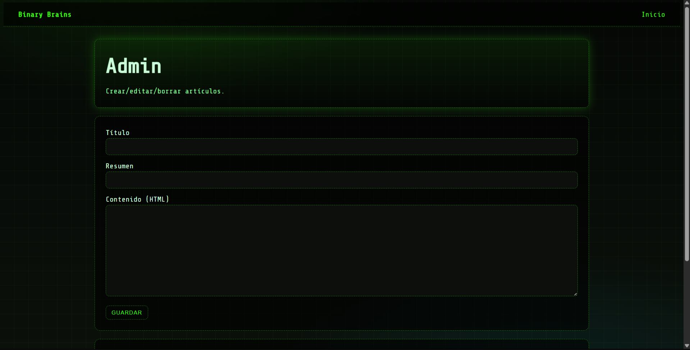

# Personal-Blog
Personal Blog
Build a personal blog to write and publish articles on various topics.


You are required to build a personal blog where you can write and publish articles. The blog will have two sections: a guest section and an admin section.

# Personal Blog 
Personal blog made in Spring Boot with static frontend (HTML/CSS/JS) and REST backend that stores articles in JSON.




## 🚀 Requirements
- Java 17+
- Maven 3.9+
- Modern Browser

## ⚙️ Execution
```bash
mvn spring-boot:run

User : admin
Password : admin123
